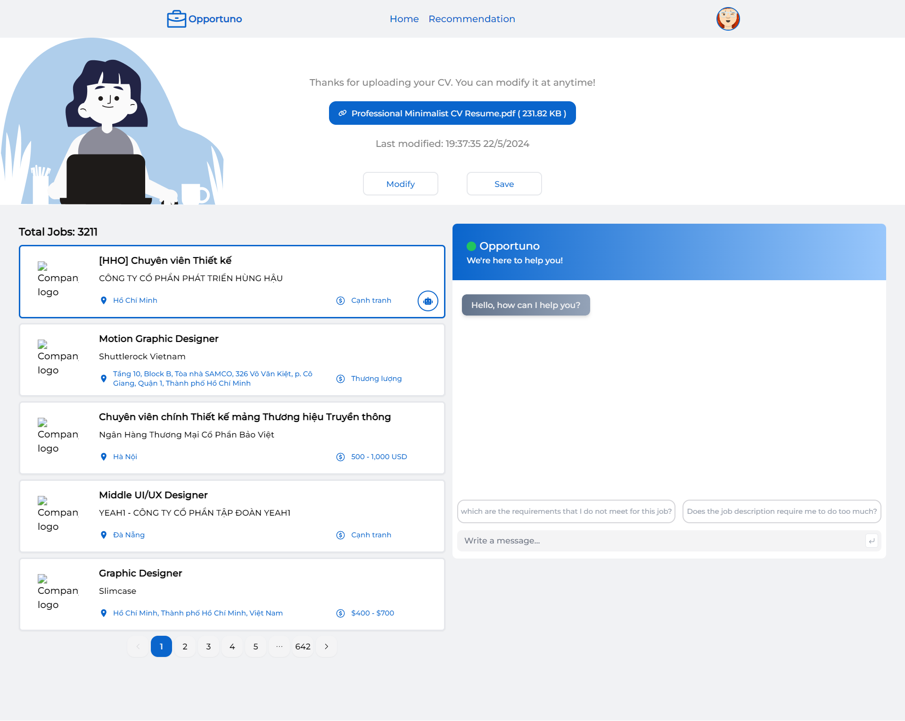
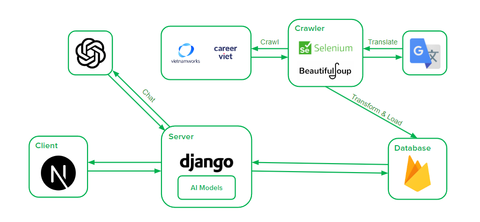
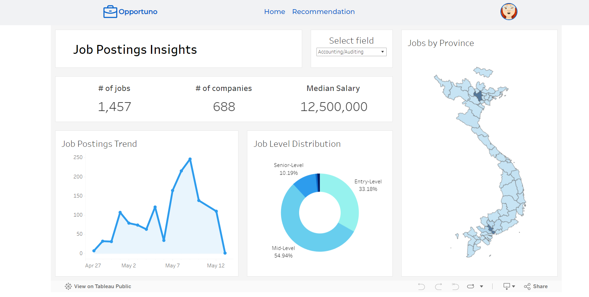

Opportuno
============
###
This is an automated job search platform with AI features powered by NextJS, Django and Firebase.
---
### You can check the branches of the project for the features.

---
## Contributors

<table>
  <tr>
  <td align="center">
        <a href="https://github.com/MinhQuan020903">
            
             
            
                <b>Do Mai Minh Quan</b>
            
        </a>
         
        </a> 
    </td>
    <td align="center">
        <a href="https://github.com/phathnv">
            
             
            
                <b>Ho Ngoc Vinh Phat</b>
            
        </a>
         
        </a> 
    </td>
    <td align="center">
        <a href="https://github.com/quannguyen2153">
            
             
            
                <b>Nguyen Minh Quan</b>
            
        </a>
         
        </a> 
    </td>
    <td align="center">
        <a href="https://github.com/42nvtn">
            
             
            
                <b>Ngo Van Trung Nguyen</b>
            
        </a>
         
        </a> 
    </td>
  </tr>
</table>

---
## Features
- Give insights of the job market with dashboard
- Give job recommendations based on the user's CV
- An AI assistant that helps explaining to user about a specific job

---
## Demo
Here is a working demo video: <a href="https://drive.google.com/file/d/1Gv-bPND4OWOBdq_bR9Ockyil7xJ_UIep/view?usp=drive_link" target="_blank">link</a>

---

### Architecture

## Site
### Dashboard page

### Recommendation page

